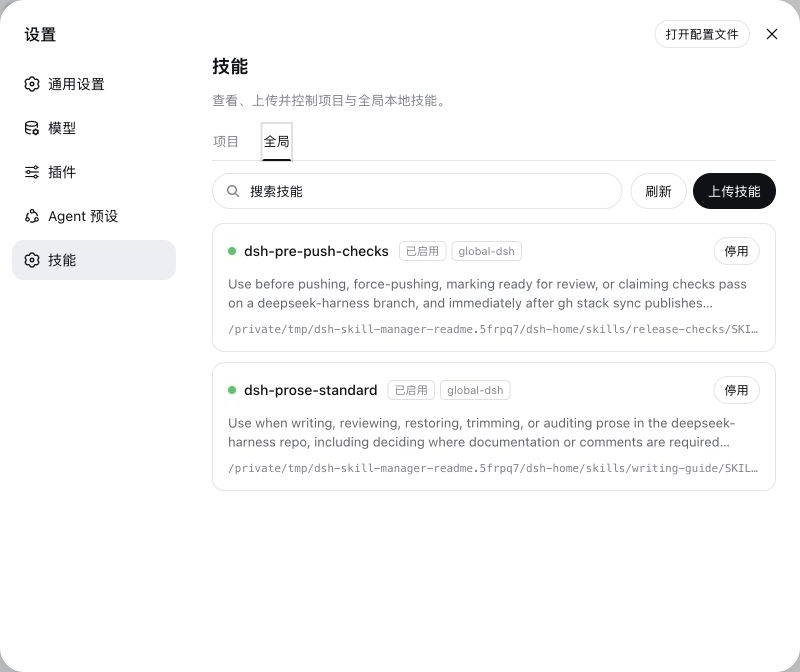

# DSH Skill Manager

[English](README.md) | 中文

DSH Skill Manager 为 DSH Web 增加一个可视化技能管理页。它会查找项目和全局的本地 Skill，显示实际生效的副本，支持上传新 Skill，并让你无需手动移动文件就能启用或停用 Skill。



截图来自隔离的演示环境，不包含个人 Skill 数据。

## 可以做什么

- 自动查找 DSH 标准项目目录和全局目录中已经安装的 Skill。
- 分开管理项目 Skill 与全局 Skill。
- 按名称、描述、来源或路径搜索。
- 上传单个 `SKILL.md`，或者上传包含脚本、模板和多个 `references/` 文件的 ZIP 技能包。
- 在保留全部文件和资源的情况下启用或停用 Skill。
- 标记无效或被遮蔽的条目，让名称和 frontmatter 问题直接可见。

## 使用要求

- macOS、Linux 或 Windows，并安装 Node.js `^22.19.0 || >=24.0.0`。
- DSH Web。当前版本已在 `@deepseek-ai/dsh@0.1.0-rc.6` 上验证。
- 不需要全局安装 pnpm；下面的命令会通过 `npx` 临时下载 pnpm 执行器。

## 安装

### 1. 将插件添加到 Web profile

在终端运行：

```sh
npx -y -p pnpm@11.19.0 -p @deepseek-ai/dsh \
  -c 'dsh plugin --profile web add github:ZzzzzzzLL/dsh-skill-manager --config.auto-install-peers=false'
```

这条命令会下载当前 GitHub 仓库、构建插件，并将它加入 DSH 的 `web` profile。整个过程不需要下载 DSH 源码。

### 2. 启动 DSH Web

```sh
npx @deepseek-ai/dsh web --port 3080
```

打开 DSH 输出的地址，通常是 [http://127.0.0.1:3080](http://127.0.0.1:3080)。如果 3080 端口已被占用，可以改用 `--port 3081`。

### 3. 打开技能管理器

在 DSH Web 中进入 **设置 → 技能**。使用 **项目** 标签管理当前 Workspace 的 Skill，使用 **全局** 标签管理所有 Workspace 都能使用的 Skill。

## 日常使用

### 上传 Skill

点击 **上传技能**，然后选择以下任一种格式：

- 一个带有有效 Skill frontmatter 的 UTF-8 `.md` 文件。
- 一个 `.zip` 技能包，其中必须恰好包含一个 `SKILL.md`，并且该文件位于 ZIP 根目录或第一层目录中。

在配置上限范围内，ZIP 可以包含任意数量的普通资源文件。典型结构如下：

```text
my-skill/
├── SKILL.md
├── scripts/
│   └── run.sh
└── references/
    ├── api.md
    ├── examples.md
    └── guides/
        └── advanced.md
```

管理器会完整保留目录结构，包括 `references/` 下的每一个文件。默认情况下，ZIP 最大为 5 MiB，最多包含 256 个条目，解压后的总大小不超过 20 MiB。

### 启用或停用 Skill

点击 **停用** 后，Skill 文件仍保留在磁盘上，但不会再被 DSH 正常发现；点击 **启用** 可以恢复它。管理器完成自己的操作后会自动刷新；如果其他程序修改了 Skill 文件，请点击 **刷新**。

### 理解项目与全局

- **项目**读取 `<project>/.dsh/skills` 和 `<project>/.agents/skills`，离 Workspace 最近且包含 `.git` 的父目录会被视为项目根目录。
- **全局**读取 `$DSH_HOME/skills` 和 `$DSH_AGENTS_HOME/skills`，默认分别是 `~/.dsh/skills` 和 `~/.agents/skills`。

## 更新或卸载

更新 GitHub 安装：

```sh
npx -y -p pnpm@11.19.0 -p @deepseek-ai/dsh \
  -c 'dsh plugin --profile web update dsh-skill-manager'
```

卸载插件但保留已有 Skill：

```sh
npx -y -p pnpm@11.19.0 -p @deepseek-ai/dsh \
  -c 'dsh plugin --profile web remove dsh-skill-manager'
```

## 安全与限制

管理 API 只接受本机回环浏览器连接。Host 负责解析 Workspace id 和文件系统路径，浏览器不能选择任意目标目录。上传内容发布前会校验 UTF-8、ZIP 路径、条目数量、解压大小、Skill frontmatter，以及启用或停用条目的名称冲突。

同一个 DSH Host 进程内的操作会串行执行，但其他进程仍可能同时修改相同目录。遇到意外冲突时，请先检查文件并点击 **刷新** 再重试。自定义 provider root 和随 DSH 打包的系统 Skill 仍由原 provider 展示，不由当前插件管理。

## 开发

克隆当前仓库，使用 Node.js `^22.19.0 || >=24.0.0`，然后运行：

```sh
npx -y pnpm@11.19.0 install
npx -y pnpm@11.19.0 run build
```

该包会分别构建 Host 与浏览器 bundle，也可以通过 `dsh plugin --profile web add link:/absolute/path/to/dsh-skill-manager` 将 checkout 链接到 Web profile。

## 许可证

[MIT](LICENSE)
